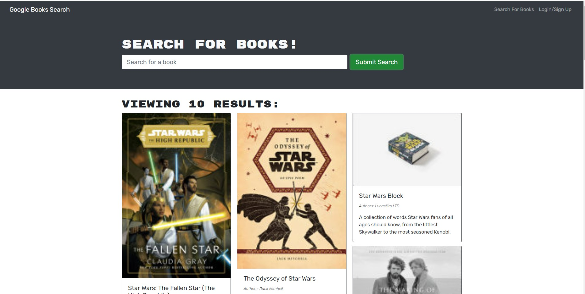

# Book-Search_Engine

# Description
The Book search engine is an application is leveraging the entire MERN stack and with a React front end, MongoDB database, and Node.js/Express.js server and API. It's set up to allow users to save book searches to the back end. The application is built using Google Books API search engine build with GraphQL API and Apollo Server.

This project was bootstrapped with Create React App.

# Usage
This application allows to search for the books, save books to your saved book list and remove books from the saved book list.

# Questions 
If you have any questions contact me karmnamol@gmail.com